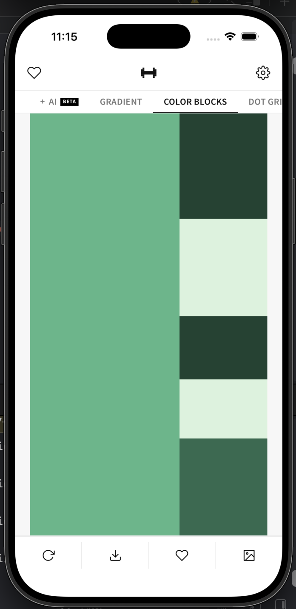
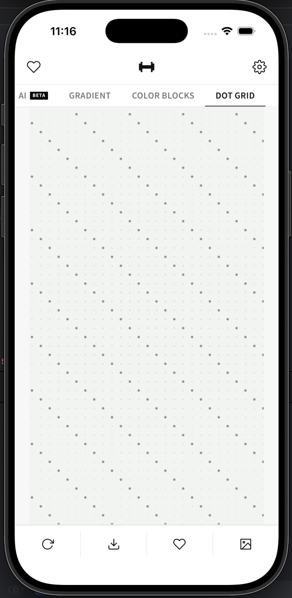
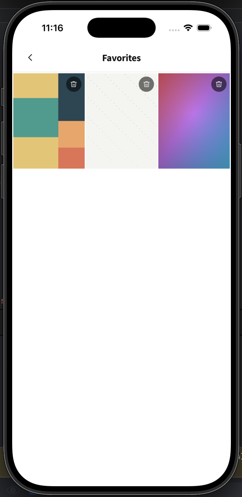

# Haze

Haze is a minimalist wallpaper generator for iOS and Android. It produces a new wallpaper every day, seeded by the date — same day, same wallpaper. Four generation modes: smooth gradients, Mondrian-style color blocks, engineered dot grids, and AI-generated scenes powered by Pollinations.ai.

Built with React + TypeScript, packaged as a native iOS/Android app via Capacitor. No design tools required — every wallpaper is generated in-browser using the Canvas API.


---

## Screenshots

| Gradient | Color Blocks | Dot Grid | AI | Favorites |
|---|---|---|---|
|  |  |  |  |

> Place screenshots in `.github/screenshots/` and update the paths above.

---

## Features

- **Four wallpaper modes** — Gradient (30 palettes), Color Blocks (22 Mondrian-style palettes), Dot Grid (20 palettes, 4 variation modes), and AI (Pollinations.ai Flux, 3 generations/day)
- **Date-seeded determinism** — the same seed on the same day always produces the same wallpaper; swipe down to get a fresh variation
- **Light / Dark / Auto palette** — follows the OS color scheme or can be locked in Settings
- **Favorites** — save any wallpaper to your Firestore account; tap to reload it at its exact seed
- **Save to Photos** — Camera Roll on iOS, gallery album on Android
- **Set as Wallpaper** — native `WallpaperManager` on Android; guided instructions on iOS
- **Guest mode** — generate and save without an account; sign in to unlock favorites and AI generation
- **Swipe navigation** — horizontal swipe between modes; pull down to regenerate

---

## Tech Stack

| Layer | Technology |
|---|---|
| Framework | Ionic 8 + React 19 + TypeScript |
| Build | Vite |
| Native | Capacitor 8 |
| Auth | Firebase Authentication — Google, Email/Password, Anonymous |
| Database | Cloud Firestore |
| AI | Pollinations.ai (Flux model) via Firebase Cloud Functions (Node 20) |
| Graphics | Canvas API — zero external graphics libraries |
| Fonts | Source Sans Pro |
| PRNG | Custom `mulberry32` seeded generator |

---

## Getting Started

### Prerequisites

- Node 24 via nvm
- Firebase project (see [Firebase Setup](#firebase-setup))

### Web

```bash
nvm use 24
npm install
cp .env.example .env
# Fill in .env with your Firebase project values
npm run dev         # → http://localhost:5173
```

### iOS

```bash
npm run build
npx cap sync
npx cap open ios    # Opens Xcode → select device → Run
```

Requires macOS + Xcode. Place `GoogleService-Info.plist` (downloaded from Firebase Console) at `ios/App/App/`.

### Android

```bash
npm run build
npx cap sync
npx cap open android  # Opens Android Studio → Run
```

Place `google-services.json` (downloaded from Firebase Console) at `android/app/`.

---

## Environment Variables

Copy `.env.example` to `.env` and fill in the values from **Firebase Console → Project Settings → Your apps**.

```env
VITE_FIREBASE_API_KEY=
VITE_FIREBASE_AUTH_DOMAIN=
VITE_FIREBASE_PROJECT_ID=
VITE_FIREBASE_STORAGE_BUCKET=
VITE_FIREBASE_MESSAGING_SENDER_ID=
VITE_FIREBASE_APP_ID=
```

`.env` is gitignored. Never commit it.

---

## Firebase Setup

### 1. Create a Firebase project

Go to [Firebase Console](https://console.firebase.google.com), create a project, and enable:
- **Authentication** — Google, Email/Password, Anonymous providers
- **Firestore** — production mode
- **Cloud Functions** — Blaze plan required

### 2. Deploy Firestore rules

```bash
firebase deploy --only firestore:rules
```

Rules enforce that users can only access their own data (`/users/{uid}/**`). Anonymous users are blocked from write operations.

### 3. Deploy Cloud Functions

```bash
cd functions && npm install && cd ..
firebase deploy --only functions
```

No API key is required. AI generation uses [Pollinations.ai](https://pollinations.ai) which is free and keyless.

### 4. Google Sign-In — iOS URL scheme

Add the `REVERSED_CLIENT_ID` from `GoogleService-Info.plist` to `ios/App/App/Info.plist`:

```xml
<key>CFBundleURLTypes</key>
<array>
  <dict>
    <key>CFBundleTypeRole</key>
    <string>Editor</string>
    <key>CFBundleURLSchemes</key>
    <array>
      <string>com.googleusercontent.apps.YOUR_CLIENT_ID</string>
    </array>
  </dict>
</array>
```

### 5. Google Sign-In — Android SHA-1

Register your debug and release SHA-1 fingerprints in Firebase Console → Project Settings → Android app:

```bash
# Debug
keytool -list -v \
  -keystore ~/.android/debug.keystore \
  -alias androiddebugkey \
  -storepass android -keypass android
```

---

## AI Generation

AI wallpapers use **[Pollinations.ai](https://pollinations.ai) (Flux model)** via a Firebase Cloud Function. The function:

- Verifies Firebase Authentication (anonymous users are blocked)
- Enforces a **3 generations per user per day** limit stored in Firestore at `users/{uid}/usage/ai`
- Adapts the prompt to the user's current palette preference (light / dark)
- Returns a base64-encoded image — no image is stored server-side
- No API key required — Pollinations.ai is free and open

Generation failures (timeout, API error) are **not counted** against the daily limit.

### Resetting a user's daily limit (for testing)

In Firebase Console → Firestore → `users/{uid}/usage/ai`, set `count` to `0` or `date` to any past date.

```bash
# Or via CLI
firebase firestore:delete users/USER_UID/usage/ai --project YOUR_PROJECT_ID
```

---

## Native Permissions

### iOS (`Info.plist`)

| Key | Purpose |
|---|---|
| `NSPhotoLibraryAddUsageDescription` | Saving wallpapers to Camera Roll |

### Android (`AndroidManifest.xml`)

| Permission | Purpose |
|---|---|
| `INTERNET` | Firebase + web content |
| `WRITE_EXTERNAL_STORAGE` (maxSdk 29) | Gallery save on Android ≤ 9 |
| `READ_MEDIA_IMAGES` | Gallery save on Android 13+ |
| `SET_WALLPAPER` | Native wallpaper setter |

---

## Project Structure

```
src/
  pages/
    Auth.tsx              # Sign in / sign up / guest entry
    Home.tsx              # Main wallpaper screen — 4-panel swiper
    Favorites.tsx         # Saved favorites grid
    FavoritesViewer.tsx   # Full-screen favorite viewer
    Settings.tsx          # Palette preference, account, sign out
  components/
    TopBar.tsx            # App mark + navigation icons
    ActionBar.tsx         # Generate | Save | Set Wallpaper | Favorite
    StyleToggle.tsx       # AI / Gradient / Color Blocks / Dot Grid tabs
    ConfirmationBar.tsx   # Inline toast notification
    WallpaperSheet.tsx    # iOS wallpaper instruction sheet
  generators/
    gradient.ts           # 26-palette gradient generator
    colorblocks.ts        # 22-palette Mondrian block generator
    dotgrid.ts            # 20-palette dot grid generator (4 variation modes)
  hooks/
    useWallpaperGenerator.ts  # Style, seed, and render orchestration
    useSaveWallpaper.ts       # Save + set wallpaper + permissions
    useFavorites.ts           # Firestore favorites CRUD
    useAuth.ts                # Auth context consumer
  context/
    AuthContext.tsx       # Firebase auth state + Firestore profile sync
  firebase/
    config.ts             # Firebase init (env-var based)
    auth.ts               # Auth methods
    firestore.ts          # Favorites and usage helpers
  utils/
    seededRandom.ts       # mulberry32 PRNG, dateSeed, compoundSeed
    canvasExport.ts       # Canvas → Photos / share
    platform.ts           # Capacitor platform detection
functions/
  src/
    index.ts              # Cloud Function exports
    generateAIWallpaper.ts  # Pollinations.ai (Flux) + rate limiting
firestore.rules           # Firestore security rules
```

---

## Commands

```bash
npm run dev                            # Vite dev server → localhost:5173
npm run build                          # TypeScript + Vite build → dist/
npx cap sync                           # Sync dist/ to iOS and Android
npx cap open ios                       # Open Xcode
npx cap open android                   # Open Android Studio
npm run lint                           # ESLint
npm run test.unit                      # Vitest unit tests
npm run test.e2e                       # Cypress end-to-end tests
node scripts/generate-icons.cjs        # Regenerate app icons and splash screens
firebase deploy --only firestore:rules # Deploy Firestore security rules
firebase deploy --only functions       # Deploy Cloud Functions
```

---

## Security

- All Firebase config values are loaded from environment variables — no hardcoded credentials
- AI generation uses Pollinations.ai — no API key is required or stored
- `GoogleService-Info.plist` and `google-services.json` are gitignored
- Firestore rules enforce per-user data isolation at the database level
- Cloud Function verifies Firebase auth tokens server-side on every request
- Anonymous users are blocked from AI generation both client-side and server-side

---

## License

MIT
